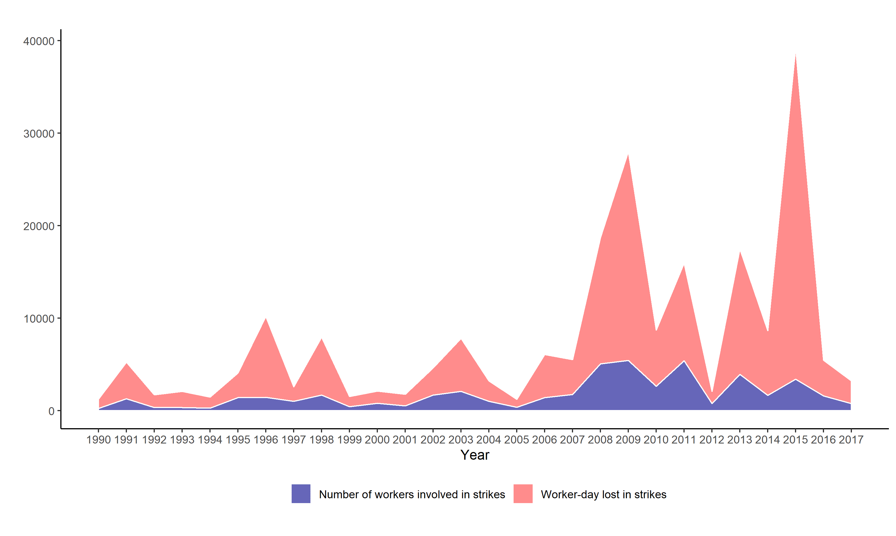
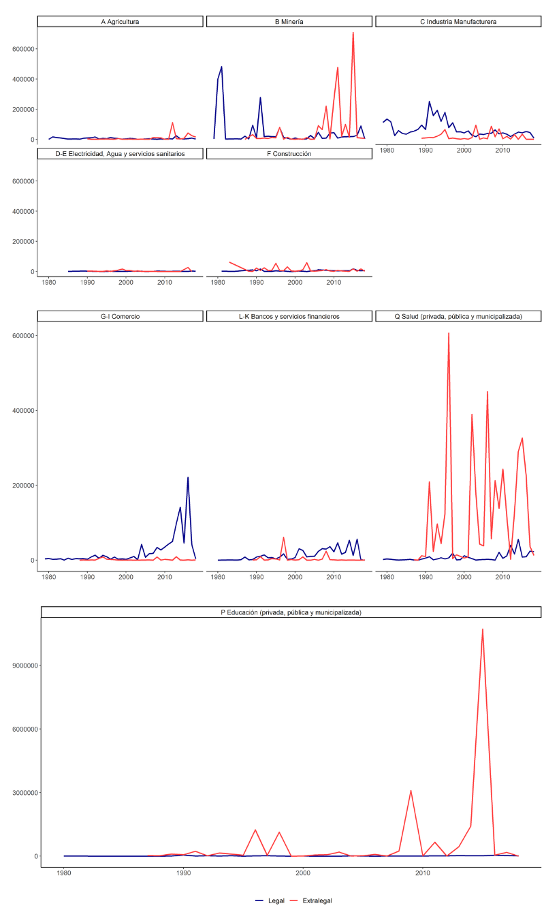

```{r setup, include=FALSE}
knitr::opts_chunk$set(comment=NA, prompt=FALSE, cache=FALSE, echo=TRUE, results='asis', message = F, warning = F)
summarytools::st_options(bootstrap.css     = FALSE,
           plain.ascii       = FALSE,   
           style             = "rmarkdown",
           dfSummary.silent  = TRUE, 
           footnote          = NA,
           subtitle.emphasis = FALSE,
           headings =  F,
           lang =  "es")
summarytools::st_css()
library(ggplot2); library(sjPlot)
theme_set(theme_sjplot2())
options(knitr.kable.NA = 'No sabe/No responde', kableExtra.auto_format = FALSE)
```


```{r load, echo = F}
# 1. Cargar librarias
pacman::p_load(tidyverse, sjPlot, summarytools,
               magrittr, ggmosaic, texreg, kableExtra,
               ggeffects)

# 2. Cargar base de datos
rm(list = ls())
load("data/issp-proc2.RData")
issp <- issp19_09_99; remove(issp19_09_99)
issp <- issp %>%
  filter(!is.na(class)&!is.na(identity_r)&!is.na(union)& !is.na(typewrk)&!is.na(region)&!is.na(sex)&!is.na(age), !is.na(class))
```


# Introducción

Durante décadas, Chile fue considerado un caso exitoso de transición democrática, estabilidad política y desarrollo económico neoliberal. En este contexto, diversos analistas sostuvieron que el país se había transformado en una sociedad de “clase media” [@leon2007; @espinoza2013; @castillo2013a], en la cual la emergencia de identidades de clase trabajadora y de conflictos “tradicionales” centrados en demandas económicas serían reemplazados por otros basados en distinciones de estatus [@espinoza2013]. Sin embargo, con el renacer de la movilización social y la política contenciosa observados desde inicios de la década del 2010, algunas de estas ideas comenzaron a ser puestas en duda. Desde 2011 en adelante, movimientos estudiantiles, sindicales, ambientalistas, por la diversidad sexual y feministas han cuestionado los aspectos centrales del régimen postdictatorial chileno. Desde diferentes perspectivas, estos movimientos han criticado la ausencia de reformas sustanciales a los principales pilares políticos, económicos e institucionales heredados de la dictadura de Pinochet [@donoso2017]. En este ambiente de movilización social ascendente, el país ha sido testigo de un renacer de la actividad sindical importante, pero pocas veces notado. Este renacer del sindicalismo chileno se ha apreciado en el aumento exponencial de la actividad huelguística a nivel de empresas y en la utilización de huelgas generales llevadas a cabo con fines políticos [@ohl2016; @ohl2020; @santibanez2017]. Todos estos procesos tuvieron su punto más álgido entre octubre y diciembre de 2019. En dichos meses, millones de chilenos y chilenas, así como cientos de agrupaciones territoriales, organizaciones sociales y sindicatos, salieron a las calles demandando transformaciones profundas al modelo político y económico imperante. En el transcurso de marchas y llamados a huelga general, los ciudadanos demandaron desde mejoras significativas en los salarios y la provisión de derechos sociales como salud, vivienda, pensiones y educación, hasta una nueva constitución llevada a cabo a través de una asamblea constituyente [@santibanez2019; @unidadsocial2019].
Este ciclo de movilización social iniciado en 2011 ha tenido un impacto profundo en la sociedad chilena. A nivel individual, los chilenos y chilenas se han politizado, y su disposición a participar en acciones políticas “no convencionales”—por ejemplo, protestas—ha aumentado significativamente [@pnud2015]. En el ámbito propiamente laboral, la participación en sindicatos ha aumentado, tal como lo ha hecho la confianza en las organizaciones sindicales [@direcciondeltrabajo2018; latinobarometro2018]. En el ámbito político-institucional, por otro lado, los partidos tradicionales se han visto en la necesidad de integrar estas demandas ciudadanas como forma de enfrentar la emergencia de nuevas coaliciones políticas progresistas, como el Frente Amplio. Esto ha re-politizado el debate sobre desigualdad y redistribución, el cual fue tratado de forma altamente tecnocrática en las décadas previas, al tiempo que ha reforzado el clivaje izquierda-derecha en el país [@donoso2017; @roberts2017]. 
Estos fenómenos han hecho que la investigación sobre clases sociales en Chile reinterprete o cuestione una serie de afirmaciones sostenidas en las décadas de los 90 y los 2000. Algunos investigadores han puesto en duda la tesis de que Chile sea efectivamente un país de “clase media”, mostrando que la desigualdad entre clases y la estructura de clases en general sigue siendo muy resistente al cambio [@gayo2016; @barozet2017]. De hecho, algunos indican que, lejos de ser un país con una identidad de clase media, en Chile la identidad de clase trabajadora es prevalente. @elbert2018 muestran, por ejemplo, que en Chile los niveles de identificación con la clase trabajadora son incluso más altos que los observados en países como Argentina. 

A través de este tipo de hallazgos, estas investigaciones han sugerido que estudiar la estructura y la identidad de clases sigue siendo muy relevante para entender el conflicto político y social del país. En esa línea, en este artículo estudiamos los determinantes de la identidad de clases en Chile y su cambio a lo largo de las últimas tres décadas. Para ello, estimamos modelos de regresión logística con datos del módulo Desigualdades Sociales de la encuesta ISSP (*International Social Survey Programme*), para los años 1999, 2009 y 2019. Primero, analizamos cómo la posición de clase de las personas afecta su probabilidad de identificarse con la clase trabajadora. Segundo, estudiamos el posible impacto de la revitalización sindical observada en la última década, examinando si el estar afiliado a un sindicato afecta positivamente dicha identidad de clase trabajadora. Tercero, analizamos el posible efecto de los procesos generales de movilización social y politización de la sociedad chilena, estudiando si la identificación con la clase trabajadora se ha reforzado a través del tiempo—particularmente, si ella ha aumentado en 2019, en comparación a 1999 y 2009. Por último, en este artículo examinamos si este efecto temporal ha reforzado, además, el impacto que tiene la posición de clase y la afiliación sindical sobre la identidad de clase. 
En línea con lo planteado como hipótesis, nuestros hallazgos sugieren que la posición de clase es un determinante significativo de la identidad de clases. Sin embargo, contrario a lo planteado hipotéticamente, los resultados no nos permiten concluir que la afiliación sindical incremente de modo significativo la identificación con la clase trabajadora. Nuestros hallazgos tampoco nos permiten concluir que la identidad de clase trabajadora se haya reforzado en la última década como efecto de los procesos de movilización social, ni que, producto de dicho efecto temporal, el impacto de la clase o la sindicalización sobre la identidad se haya reforzado significativamente. Al final del artículo interpretamos esta ausencia de efecto temporal, señalando cómo este devela aspectos complejos, y pocas veces notados, de la desigualdad de clases en Chile (por ejemplo, los niveles sorprendentemente altos de identificación con la clase trabajadora observados en todo el periodo estudiado, y especialmente a fines de los años 90).  
	En este artículo, presentamos este argumento en las secciones siguientes. A continuación, mostramos evidencia sobre el aumento de la movilización social y la actividad sindical en Chile, así como sobre sus efectos a nivel individual y social. Luego, presentamos investigaciones recientes sobre identidad de clases y sobre el lugar que dicho concepto ocupa en el análisis de clases. Después de mostrar las hipótesis que orientaron la investigación, en la siguiente presentamos los datos y métodos. A continuación, mostramos los resultados de los análisis estadísticos y hacemos una discusión sobre como ellos nos permiten aceptar o rechazar las hipótesis planteadas. Por último, en la sección final mostramos las conclusiones de este trabajo y sus implicancias para la investigación empírica. 

# Desigualdad de clases, protesta social y revitalización sindical en Chile 
Desde el término de la dictadura militar en 1990, Chile fue considerado un caso exitoso de transición política y económica en la región. Durante décadas, la elite política chilena, desde la centroizquierda hasta la derecha, construyó acuerdos políticos que permitieron una transición democrática estable. Ellos implico, sin embargo, la mantención de las políticas de libre mercado iniciadas durante la dictadura militar. Así, pesar de los altos niveles de desigualdad socioeconómica y de concentración de ingresos observados en el país [@torche2005; @espinoza2014], entre 1990 y 2010, el régimen neoliberal no fue mayormente cuestionado desde la institucionalidad política. Junto con esto, la inexistencia de movimientos sociales anti-neoliberales de envergadura, así como la debilidad de actores de clase tradicionales (como el movimiento sindical) hizo poco probable la aparición de “política contenciosa” en Chile [@silva2009; @donoso2017]
En este contexto de hegemonía neoliberal, la emergencia de identidades y formas de acción colectiva de clase “tradicionales” fue vista como poco factible o improbable [@leon2007; @ruiz2015; @espinoza2013]. Este pronóstico realizado por diversos analistas interesados en el estudio de las clases sociales compartía algunos elementos destacados en la literatura internacional. Según ésta, la transformación neoliberal produjo cambios políticos y económicos que desestructuraron las formas “clásicas” de relación entre capital y trabajo. En su versión más extrema—por ejemplo, en la tesis del “fin de las clases” planteada por @pakulski1996 — esta literatura señaló que, pese a la existencia de desigualdad social, la clase social ya no cumplía un rol relevante en la conformación de identidades sociales y en la explicación de la acción colectiva. Sin sostener necesariamente esta versión extrema, diversos analistas estudiaron cómo los cambios políticos y económicos asociados a la transformación neoliberal afectaron la estructuración de actores colectivos de clase. En términos políticos, dichos cambios implicaron la inversión ideológica de parte importante de los partidos de izquierda, particularmente, su adopción de orientaciones neoliberales. Tanto en Chile como con el resto de América Latina, esto se tradujo en el distanciamiento progresivo entre antiguos partidos de tradición obrera y sindicatos [@roberts2002; @carneiro2020]. En términos económicos, la transformación neoliberal estuvo acompañada de la desindustrialización de las economías heredadas del modelo de Industrialización Sustitutiva de Importaciones (ISI). Esto produjo el debilitamiento de los movimientos sindicales tradicionales anclados en el sector industrial manufacturero [@roberts2002; @stillerman2007; @collier2009]. 
En las décadas de los 90 y los 2000, estos fenómenos fueron claves para analizar la debilidad de las identidades de clase “tradicionales” en Latinoamérica. Sin embargo, la manera en cómo se interpretó su impacto varió según la realidad político-económica de cada país. En países como Argentina, por ejemplo, se planteó que la desindustrialización estuvo acompañada de un crecimiento del sector informal derivado de la desregulación del mercado del trabajo. Esto implicó la fragmentación de los sectores populares y un debilitamiento de las identidades de clase obrera tradicional, las cuales fueron reemplazadas por formas de identificación popular más amplias que las derivadas directamente de la relación laboral propia del modelo ISI [@svampa2000; @roberts2002; @collier2009]. En contraposición a esta idea, en el caso chileno el debilitamiento de las identidades de clase tradicionales se interpretó como un efecto de la ampliación de la clase media. Según este argumento, la transformación neoliberal produjo un crecimiento de las actividades de servicio del sector privado y, por tanto, un incremento de las ocupaciones “de clase media”. Esto se tradujo, a su vez, en la adopción de identidades, valores y actitudes de clase media por parte de la mayoría de los y las trabajadoras chilenas [@ruiz2015, pp. 156; @leon2007;@espinoza2013, pp. 179-181]. Según este argumento, el reforzamiento de las identidades de clase media incrementó el conformismo político de los asalariados, al tiempo que significó una fuente de legitimidad importante para el modelo neoliberal en su conjunto [@castillo2013a, pp. 171].
	Hasta inicios de la década de 2010, este tipo de argumentos parecía robusto. Sin embargo, desde 2011 Chile ha testigo de un renacer de la “política contenciosa” expresado en la aparición de movimientos sociales que, a través de protestas masivas, han exigido transformaciones institucionales profundas en el país [@donoso2017]. @roberts2017 sostiene que estas protestas difirieron de las observadas en otros países de la región en el hecho de que ellas no tuvieron un carácter antineoliberal “defensivo” sino que, más bien, representaron un rechazo a injusticias acumuladas en un contexto de liberalización avanzada. Según Roberts, eso explica por qué, a pesar de su diversidad, las demandas que motivaron protestas del 2011 fueron bastante similares entre sí: de una manera u otra, todas ellas apuntaron (y todavía apuntan) a la expansión de servicios públicos desmercantilizados y al establecimiento de formas de ciudadanía social que vayan más allá de las desarrolladas en el pasado por los gobiernos de centroizquierda de la Concertación [@roberts2017, pp.232]. A pesar de que el ciclo de protesta iniciado en 2011 se interrumpió en 2014, la movilización popular ha seguido siendo recurrente en Chile. En 2016, por ejemplo, millones de personas respondieron al llamado de la organización “No + AFP” y salieron a las calles demandando el fin del sistema privado de pensiones. De manera similar, en 2018 el movimiento feminista organizó una serie de movilizaciones masivas en las que se demandó, tal como se venía haciendo hace años, cambios institucionales en materias de derechos reproductivos y sexuales, así como el establecimiento de un sistema educacional no sexista y cambios al sistema judicial para hacer frente a la violencia de género en el país [@frohmann2018]. De modo más evidente, en octubre de 2019 millones personas se tomaron las calles exigiendo no sólo mejoras sustanciales en las condiciones de vida, sino que también transformaciones profundas en el modelo económico y en el régimen político—por ejemplo, el fin de la privatización de servicios sociales y una asamblea que permitiera poner término a la constitución impuesta en 1980 por la dictadura de Pinochet [@santibanez2019; @unidadsocial2019].  
Algunos investigadores sostienen que este renacer de la protesta en Chile se explica por el progresivo distanciamiento entre movimientos sociales y actores político-institucionales como partidos políticos y gobierno [@garreton2016]. Dicho distanciamiento ha impedido el desarrollo de un sistema político representativo capaz de compensar los altos niveles de desigualdad económica del país [@somma2017a]. Otros analistas han puesto el énfasis en la desigualdad de clases o, más específicamente, en cómo la persistencia en las desigualdades económicas y de poder entre clases creó sentimientos de malestar y descontento entre la población chilena [@atria2013; @pnud2015; @luna2016; @joignant2017a; @somma2017]. Según @luna2016 [pp. 134] la actividad de protesta también se vio facilitada por diversos escándalos de corrupción, los cuales reforzaron la percepción ciudadana de que en Chile existe colusión entre elites políticas y económicas, estructurada el fin de “abusar” y obtener “lucro” (entendido por la ciudadanía como un beneficio injusto).   
Un aspecto importante pero pocas veces notado de este ciclo de movilizaciones sociales dice relación con la revitalización del movimiento sindical. Desde fines de la década del 2000, esta revitalización se ha observado en un aumento sustancial de la actividad huelguística. Entre 2005 y 2015 la cantidad de huelgas aumentó de 186 huelgas en 2005 a 230 en 2015 [@ohl2016]. Tal como se observa en la Figura 1, dicho incremento también se observó en la cantidad promedio de trabajadores involucrados en huelgas (382 en 2005 versus 3.425 en 2015) y de días-personas perdidos en huelgas (867 en 2005 versus 35.847 en 2015).

```{r fig1, echo = F, fig.cap="**Figura 1**: Promedio de trabajadores involucrados en huelgas y días-personas perdidos en huelgas (1990-2017).                                                                                                                                                 *Fuente*: Observatorio de Huelgas Laborales (1990-2017)", dpi=300, fig.width = 8, fig.height = 6}


```


Evidencia empírica procesada por el Observatorio de Huelgas Laborales indica que gran parte de este crecimiento de la actividad huelguística obedeció al aumento de huelgas “extra-legales”—es decir, ocurridas por fuera de los márgenes de la negociación colectiva legalmente reglada [@ohl2020]. La Figura 2 muestra que este incremento de la movilización laboral extra-legal ocurrió especialmente en sectores de fuerte tradición organizativa como la minería, la salud (especialmente la del sector público) y la educación (especialmente la municipal). La evidencia indica que estos fenómenos no han sido aislados, sino que obedecen a procesos iniciados a fines de la década pasada. Un ejemplo claro de estos procesos ocurrió entre 2007 y 2008, cuando sindicatos de trabajadores subcontratados de la minería y el sector forestal organizaron huelgas de carácter nacional demandando trato igualitario respecto de los trabajadores contratados (“de planta”), así como aumentos salariales y mejores condiciones de trabajo. En ambos casos, las huelgas resultaron exitosas [@aravena2009a]. Algo similar ocurrió entre 2013 y 2014, cuando sindicatos del sector portuario organizaron huelgas de alto poder disruptivo para protestar por la ausencia de derechos laborales básicos, pero débilmente protegidos en ese sector (por ejemplo, derecho a hora de colación y al reconocimiento de los sindicatos de parte de las empresas). Tal como en el caso de los trabajadores subcontratados, la acción directa resultó ser un método exitoso para conseguir las demandas articuladas por los sindicatos [@santibanez2017]. 
En este proceso de revitalización sindical también destaca lo ocurrido en el sector del comercio. En las últimas décadas, este sector ha absorbido la mayor cantidad de fuerza de trabajo en el país—actualmente, casi el 20% de los chilenos y chilenas (poco más de 1.700.000 personas) está empleados en él [@ene2020]—. Desde 2003, las actividades de comercio han sido testigos de un auge en la actividad huelguista legal, cuyo peak fue en la segunda mitad de la década de 2010 (ver Figura 2). El ejemplo más claro de esto ocurrió en julio de 2019, cuando la negociación entre la empresa Walmart y el Sindicato Interempresas Líder/Walmart (SIL) no terminó en acuerdo y el sindicato hizo efectivo su derecho a huelga. Esto significó la primera huelga legal impulsada por el SIL, el cual, con casi 15.000 afiliados, es uno de los sindicatos más grandes de Chile [@ratto2019].

```{r fig2, echo = F, fig.cap="**Figura 2**: Días-trabajadores perdidos por huelga según sector y legalidad (1980-2018)    *Fuente*: Observatorio de Huelgas Laborales (1980-2018)", dpi=300, fig.width = 8, fig.height = 7}


```

En general, la revitalización sindical observada desde fines de la década de los 2000 ha demostrado que los sindicatos han sido capaces de organizarse y, muchas veces, conseguir victorias importantes a través de la movilización [@aravena2009a; @santibanez2017; @bankmunoz2017; @manky2018]. Esto, a pesar de que la legislación que regula la relación entre capital y trabajo se deriva en gran medida de las leyes laborales pro-empresariales impuestas durante la dictadura de Pinochet a través del Plan Laboral de 1979 [@feres2009; @rojas2017]. 

Esto explica en parte el rol que jugaron los sindicatos durante el estallido social de octubre de 2019. Coordinados en el bloque sindical de Unidad Social—la coordinadora de movimientos sociales que organizó las principales protestas entre octubre y diciembre de 2019—, sindicatos de diversos sectores convocaron a la huelga general del 12 de noviembre. Esta huelga fue clave para que el gobierno de Sebastián Piñera se abriera a firmar el acuerdo político que permitió el plebiscito por una nueva constitución a desarrollarse el 25 de octubre de 2020. Más allá del evento específico—el cual tuvo, sin duda, una trascendencia política nunca antes vista desde el retorno a la democracia—esta huelga general representó un momento dentro de proceso de más largo alcance. En efecto, en los últimos diez años la huelga general se ha vuelto una táctica utilizada con mucha mayor frecuencia por los sindicatos chilenos. El informe 2020 del Observatorio de Huelgas Laborales muestra que desde 1990 en adelante se han registrado 18 huelgas generales y que, salvo una huelga convocada por la Central Unitaria de Trabajadores en 2003, la totalidad de ellas se han llevado a cabo entre 2011 y 2019. Más aún, sólo en este último año hubo 5 huelgas generales [@ohl2020]. 

En suma, tal como durante el ciclo de movilizaciones observado entre 2011 y 2014, las protestas de 2019 sugieren que las décadas de estabilidad económica y política observadas en Chile fueron insuficientes para superar la persistente desigualdad de clases—económica y de poder—existente en el país. Hasta el día de hoy, los chilenos y chilenas se movilizan demandando reformas que permitan revertir el modo en como se estructuró en régimen político económico instaurado durante la dictadura militar y consolidado en los años 90 y 2000.

## Efectos del ciclo de movilización social

Investigaciones recientes coinciden en que el ciclo de protestas iniciado en 2011 ha tenido un profundo impacto tanto en el sistema político e institucional como en los chilenos a nivel individual. A nivel individual, las protestas han repolitizado a los chilenos. Según el Informe de Desarrollo Humano en Chile del Programa de Naciones Unidas para el Desarrollo [-@pnud2015] desde 2011, los chilenos están más dispuestos a participar formas “no convencionales” de involucramiento político (por ejemplo, marchas) y a resolver cuestiones redistributivas a través de instancias deliberativas y no tecnocráticas. Junto con esto, al empujar la discusión pública sobre desigualdad, los movimientos sociales han repolitizado el debate sobre política social, el cual fue abordado de manera altamente tecnocrática entre los años 90 y 2000 [@roberts2017]. De este modo, la acción de los movimientos sociales ha ayudado a reforzar el tradicional clivaje entre izquierda y derecha en Chile, aun cuando la acción colectiva ha sobrepasado con creces los márgenes de los partidos tradicionales [@roberts2017, pp. 40-41].

Tal vez el ejemplo más claro de esto ocurrió como resultado de las movilizaciones de octubre de 2019. Datos de la encuesta Termómetro Social (2020) indican que luego de dichas protestas, un 83% de la población declaró intención de votar en el plebiscito por una nueva constitución a del 25 de octubre de 2020. Dicho informe señala que el apoyo a una nueva constitución estuvo fuertemente estructurado por la preferencia política de las personas. Mientras un 40% de quienes se identificaron con la derecha afirmó apoyar un cambio en la constitución, casi un 90% de quienes se identificaron con la izquierda lo hizo. Estas cifras tienen sentido a la luz de los resultados del plebiscito: el 78% del país aprobó una nueva constitución y el 79% de ellos señaló que ella debe ser redactada por una convención constituyente, es decir, una asamblea compuesta enteramente de ciudadanos. 
En el ámbito laboral, este tipo de fenómenos se han manifestado un aumento sostenido de la afiliación a sindicatos. Estadísticas oficiales indican que si bien el porcentaje de trabajadores que negocia colectivamente sigue siendo bajo (de menos del 10%), desde finales de la década de 2000 la tasa de afiliación sindical ha crecido lenta pero sostenidamente. Así, por ejemplo, si en 2006 un 13% de trabajadores estaba afiliado a un sindicato, en 2019 poco más del 17%—equivalente a 1.193.104 trabajadores—lo estuvo [@direcciondeltrabajo2018]. De seguir esta tendencia, es posible que en un par de años se sobrepase el máximo nivel de afiliación sindical desde el retorno a la democracia (18%), observado en 1991. El aumento de la afiliación sindical coincide, además, con un incremento en la confianza en los sindicatos. Datos de la encuesta Latinobarómetro muestran, por ejemplo, que el porcentaje de chilenos que confía “mucho” o “algo” en sindicatos aumentó de 31% en 2003 al 51% en 2015 [@latinobarometro2018].
A partir de esta evidencia, en este artículo analizamos si este incremento en la movilización y la politización ha afectado las percepciones subjetivas de la desigualdad de clase. Para ello, nos enfocamos en la identidad de clase, entendida como el conjunto de percepciones y sentidos a través de las cuales las personas se definen como parte de una clase social [@giddens1973; @mann1973; @wright1997]. Sobre la base de la evidencia ya presentada, así como lo planteado en investigaciones recientes (ver sección siguiente), este artículo se centra en cuatro tareas fundamentales. Primero, estudiamos cómo la posición de clase de las personas afecta su probabilidad de identificarse con la clase trabajadora. Segundo, analizamos si el estar afiliado a un sindicato impacta positivamente en dicha identidad de clase trabajadora. Tercero, atendiendo al aumento de la protesta social y la politización observados desde 2011, estudiamos si la identificación con la clase trabajadora se ha reforzado a través del tiempo—particularmente, si ha aumentado en la última década, en comparación a las décadas de 1990 y 2000. Por último, estudiamos si este efecto temporal ha reforzado, además, el impacto de la posición de clase y de la afiliación sindical sobre la identidad de clase. 
	En la sección siguiente definimos el concepto de identidad de clase y las hipótesis que dirigen esta investigación. Luego, en las secciones posteriores detallamos los datos y métodos, así como los resultados de nuestros análisis. Finalmente, en la sección final presentamos las conclusiones y sus implicancias para la investigación futura.  
   
## Identidad de clase y sus determinantes 

El concepto de identidad de clase ocupa un lugar central en las investigaciones preocupadas por la desigualdad de clases y sus efectos subjetivos [@giddens1973; @mann1973;@jackman1983; @vanneman1987; @andersen2012; @elbert2018; @oddsson2018]. En sociología, la identidad de clase es definida como el conjunto de procesos subjetivos—sentidos y percepciones—a través de los cuales las personas se definen como parte de una clase social; es decir, como parte de un colectivo que cumple un rol distintivo en el proceso de producción [@mann1973, pp. 13]. Siguiendo la perspectiva marxista de @wright1997, en este trabajo definimos la identidad de clase considerando no sólo el modo en que ella genera sentidos de pertenencia en clases diferentes, sino que también cómo ella coexiste con intereses de clases antagónicos. De este modo, concebimos a la identidad de clase como el conjunto de sentidos subjetivos a través de los cuales las personas definen “quién es similar y quién es diferente a ellas, así como quiénes son sus amigos y potenciales enemigos dentro del sistema económico” [@wright1997, pp. 396]. A partir de esta idea, entendemos la identidad de clase como una precondición de niveles más “elevados” de conciencia de clases que, bajo ciertas condiciones, puede traducirse en acción colectiva. En otras palabras, siguiendo estudios sociológicos tradicionales de la conciencia de clase, sostenemos que cuando la identidad de clase es fuerte, las personas son más conscientes de la existencia de desigualdad social, de la existencia de intereses antagónicos entre clases y, en ciertas circunstancias, de la necesidad de actuar colectivamente para cambiar el status quo [@lopreato1972; @giddens1973; @mann1973; @wright1997]. 
	El estudio empírico de la identidad de clase ha sido desarrollado desde dos perspectivas complementarias. Por un lado, investigaciones centradas en sus determinantes estructurales de la consciencia de clase han estudiado, a través de métodos cuantitativos, cómo la posición objetiva de clases de las personas, derivada de su posición en las relaciones de producción, afecta la conciencia de los intereses materiales de clase [@wright1997; @wallace2003;@elbert2018]. En estas investigaciones, la identidad de clase es comúnmente entendida como un mecanismo que refuerza dicha conciencia de los intereses de clase [@wright1997;@robison2018]. Por otro lado, investigaciones enfocadas en los procesos de construcción de identidad han estudiado, generalmente a través de métodos históricos y cualitativos, cómo en ciertas condiciones históricas las experiencias de clase (por ejemplo, experiencias de explotación y opresión) crean un sentido de comunidad y solidaridad expresado en culturas, tradiciones y valores de clase que, en última instancia, son entendidos como el motor de la acción colectiva [@thompson1966; @sewell1980; @fantasia1988; @biernacki1995; @steinberg1999]. 
	Sin desestimar los aportes de este último enfoque, en este artículo estudiamos la identidad de clase en Chile analizando, a través de métodos cuantitativos, sus determinantes de nivel individual. De este modo, analizamos cómo la posición objetiva de clases determina las probabilidades de que las personas se identifiquen una clase en particular (en este caso, con la clase trabajadora). Investigaciones previas muestran que este tipo de análisis es una buena forma de estudiar la identidad de clase a través de métodos cuantitativos [cf. @jackman1983; @lockwood1989; @hout2008; @andersen2012; @oddsson2018]. Al examinar los determinantes individuales de la identidad de clase, estas investigaciones han demostrado que quienes están en posiciones más desaventajadas social y económicamente—por ejemplo, personas de clase trabajadora o de bajos ingresos—tienen más probabilidades de identificarse como parte de una clase “baja” [@hout2008; @andersen2012; @oddsson2018; @elbert2018]. @andersen2012 señalan, por ejemplo, que quienes viven en hogares de menores ingresos tienen más probabilidades de identificarse con la clase baja, y que dicho efecto es mayor en países con alta desigualdad de ingreso. En este artículo seguimos estos hallazgos y entendemos que existe identidad “de clase trabajadora” cuando las personas se posicionan a sí mismas en dicha categoría. Así, planteamos hipotéticamente que:

$H_1$: quienes se ubican en posiciones de clase trabajadora o de clase subordinada (por ejemplo, autoempleados del sector informal) tendrán mayor probabilidad de identificarse con la clase trabajadora que quienes se encuentran ubicadas en posiciones de clase “privilegiadas” (por ejemplo, empleadores, directores de empresa o gerentes de alto nivel)

Junto con analizar los determinantes de clase de la identidad de clase trabajadora, en este artículo estudiamos si dicha identidad se ve afectada por la afiliación sindical. Según @fantasia1988, la participación en sindicatos juega un rol central en la conformación de conciencia y solidaridad de clase. A través de los sindicatos los trabajadores actúan colectivamente y, durante “momentos de crisis” (por ejemplo, durante una huelga), construyen “culturas de solidaridad” que refuerzan no sólo la identificación con la clase trabajadora, sino que la disposición a la acción colectiva. Investigaciones empíricas más recientes muestran que la afiliación sindical afecta positivamente, también, la conciencia política y de clases. @kerrissey2018 demuestran que quienes están sindicalizados tienen muchas mas probabilidades de participar en organizaciones políticas, de asistir a marchas y de involucrarse en debates políticos que quienes no lo están. Otras investigaciones han demostrado, además, que quienes están sindicalizados perciben mayores niveles de oposición de clases que quienes no lo están [@wright1997; @wallace2003]. Esto nos permite plantear hipotéticamente que:

$H_2$: quienes están sindicalizados tendrán mayor probabilidad de identificarse con la clase trabajadora que quienes no lo están 

Por último, en este artículo analizamos en qué medida el ascenso de la movilización social y el cuestionamiento al modelo neoliberal observado en la última década ha reforzado la identidad de clase trabajadora. En la sección anterior se presentó evidencia que indica este estos procesos han politizado el debate sobre la desigualdad social en el país. Esto podría afectar potencialmente la forma en que las personas—particularmente, aquellas de clase trabajadora o de otra clase desaventajada—se perciben a sí mismas como parte de una clase social. A partir de esto, planteamos hipotéticamente que: 

$H_3$: la probabilidad de identificarse con la clase trabajadora en la última década será ser mayor que en la década de 1990 o de 2000

Si esta hipótesis es cierta, entonces el alza de la movilización social y la politización de la sociedad chilena post 2011 debería haber afectado también el impacto de la clase y la sindicalización sobre la identidad de clases. De modo más específico, dichos eventos deberían haber reforzado el impacto positivo de ambas variables sobre la identificación con la clase trabajadora. Esto sugiere la necesidad de plantear dos hipótesis de interacción:

$H_{4.1}$: el impacto positivo de ser de clase trabajadora o de clase subordinada sobre la identidad de clase trabajadora será mayor en la última década en comparación a las décadas de 1990 y 2000

$H_{4.2}$: el impacto positivo de la afiliación sindical sobre la identidad de clase trabajadora será mayor en la última década en comparación a las décadas de 1990 y 2000


#  Datos y métodos

Este artículo analiza datos longitudinales de una submuestra nacional probabilística y representativa de Chile, aplicada en el marco de la encuesta ISSP (*Internacional Social Survey Programme*) como parte del módulo de Desigualdades Sociales. La serie de tiempo utilizada consta de tres mediciones: 1999, 2009 y 2019.
	
El mismo cuestionario ISSP fue aplicado en los tres años. Si bien algunas variables de la encuesta fueron ligeramente modificadas a lo largo de los años, los tres cuestionarios incluyeron preguntas básicas para operacionalizar adecuadamente nuestra variable dependiente (identidad de clases), nuestros predictores de interés (posición de clase, sindicalización y año) y una serie de controles usualmente utilizados en estos estudios (edad, sexo, sector de empleo, entre otros). Al momento de realizar esta investigación, la variable ocupación de la base de datos de 2019 no estaba totalmente procesada, ya que las ocupaciones no estaban clasificadas según los códigos de la Clasificación Internacional Uniforme de Ocupaciones – CIUO[-@oit2008]. En virtud de esto, dicha codificación fue realizada por los propios investigadores [^1]. La base de datos final tuvo un n = 2.808. 

## Variable dependiente

La identidad de clase fue medida a partir de una pregunta estándar sobre autoidentificación de clase incorporada en las tres olas de la encuesta. Esta pregunta dice: “¿A cuál de los siguientes estratos sociales diría que pertenece Ud.?” Las categorías de respuesta fueron: clase baja, clase trabajadora, clase media baja, clase media, clase media alta y clase alta. A partir de categorías de respuestas, se creó una variable dicotómica en donde 1 = “clase trabajadora”. Ésta incluyó a quienes se autoidentificaron como “clase baja” y “clase trabajadora” propiamente tal. El resto de las categorías fueron definidas con el valor = 0. Éste indicó, por tanto, ausencia de identidad de clase trabajadora. A diferencia del trabajo @elbert2018, en esta investigación excluimos de la categoría “clase trabajadora” a quienes se identifican con la clase media baja. Decidimos usar esta definición restrictiva porque, en caso contrario, el nivel de identificación con la clase trabajadora hubiera sido muy alto en la gran mayoría de las clases—usando datos de 2009, Elbert y Pérez muestran, por ejemplo, que el 70% de los pequeños empleadores y 84% de los trabajadores no calificados se definen como parte de la clase trabajadora. Esto podría haber oscurecido diferencias importantes entre las categorías de nuestras variables independientes de interés, especialmente considerando que, tal como mostramos más abajo, en 1999 los niveles de identificación con la clase trabajadora fueron particularmente altos. De cualquier forma, en el curso de esta investigación validamos los resultados obtenidos utilizando una variable dependiente más amplia, tal como la utilizada por @elbert2018. Los resultados de dichos análisis, disponibles por solicitud, no mostraron diferencias sustanciales con los presentados acá. 

La Tabla 1 muestra los estadísticos descriptivos de la variable dependiente, según año.


```{r table1, echo=F}
z <- data.frame(identity_r = "Total (observaciones)", p_1999 = "2.808", p_2009 = "2.808", p_2019 = "2.808") #Total

issp  %>% 
  group_by(year,identity_r) %>%
  tally(wt=FACTOR) %>% 
  mutate(p = round(n/sum(n),3)*100,
         identity_r = ifelse(identity_r == 1, "Clase Trabajadora","Otra clase (clase media o alta)"),year = lubridate::year(year), p = paste0(p,"%")) %>% pivot_wider(names_from = year, values_from = c(n,p)) %>% select(1,starts_with("p")) %>% bind_rows(z)  %>% 
  knitr::kable(digits = 3, row.names = F,  booktabs = T,
             col.names = c("Identidad de Clase", "1999", "2009", "2019"),
             caption = "<b>Tabla 1</b>: Identificación de clase según año") %>%
            add_header_above(c("Variable dependiente" = 1, "Año" = 3)) %>% 
            kableExtra::kable_styling(latex_options = "hold_position")%>%
            kableExtra::kable_styling(bootstrap_options = "striped", full_width = F)%>%
            kableExtra::column_spec(1, width = "9cm") %>%
  kableExtra::footnote(general = "Fuente: Elaboración propia en base a ISSP 1999, 2009, y 2019. Datos ponderados", general_title = "")
```

## Variables independientes

### Posición de clase 

La posición de clase fue medida a partir de una versión modificada de diez categorías del esquema de clases propuesto por @wright1997. Wright distingue posiciones de clase a partir de tres criterios: 1) la posesión de propiedad privada de medios de producción (a partir de lo cual distingue entre clases propietarias y trabajadores asalariados), 2) el nivel de calificación (lo cual se traduce en la distinción entre asalariados expertos, calificados y no calificados) y 3) la posesión de “bienes de organización” (autoridad) dentro del proceso productivo, lo cual le permite distinguir entre asalariados que cumplen roles de gerentes o supervisores y trabajadores sin autoridad. 

A partir del primer criterio (propiedad de medios de producción), distinguimos entre: 1. empresarios (propietarios de empresas de 10 o más trabajadores), 2. pequeños empleadores (propietarios con entre 1 y 9 empleados) y 3. pequeña burguesía (autoempleados). Siguiendo investigaciones recientes [@elbert2018] y estudios tradicionales sobre mercado del trabajo Latinoamericano [@tokman2000; @prealc1978], restringimos la categoría de pequeña burguesía sólo a los autoempleados altamente calificados (es decir, con educación terciaria completa). Así, construimos una nueva categoría para identificar a los autoempleados semi-calificados o no calificados, según su pertenencia a la CIUO y su nivel educacional. Esta categoría fue definida como 10. autoempleados informales.    

A partir del segundo criterio (nivel de calificación), distinguimos a los asalariados según su condición de expertos, trabajadores calificados o no calificados. Para ello, utilizamos los códigos de la CIUO agregados a dos dígitos. En 1999 y 2009, los dígitos se basaron en la CIUO-88, mientras que en la ola 2019 ellos se basaron en la CIUO-08. En todos estos casos, el grupo de los expertos fue corregido a partir del nivel educacional. Así, se definió como “experto” a quienes estuvieran empleados en ocupaciones CIUO pertenecientes a los grupos 1 y 2 y que, al mismo tiempo, tuvieran un nivel educacional terciario completo. 

Por último, el último criterio (autoridad) nos permitió diferenciar supervisores de trabajadores asalariados sin autoridad. Si bien los datos no permiten distinguir los tres niveles de autoridad propuestos por [@wright1997, pp.74-90], la encuesta nos permitió separar a quienes tenían la capacidad de supervisar el trabajo de otros de quienes no la tenían. 

En consecuencia, a partir del nivel de calificación y de autoridad se pudo construir seis posiciones de clase asalariadas: 4. expertos directivos, 5. expertos sin autoridad, 6. supervisores calificados, 7. supervisores no calificados, 8. trabajadores calificados y 9. trabajadores no calificados. En total, sumando las cuatro posiciones de clase propietarias descritas más arriba, nuestro esquema de clases consta de 10 posiciones clase. 

La Tabla 2 presenta las frecuencias y porcentajes de cada categoría de clase para cada año. En la Tabla 3 podemos encontrar los estadísticos descriptivos para las variables de control. 


```{r table2, echo=F}
issp$class2 <- car::recode(issp$class, recodes = c('"1.Capitalists"="1.Empresarios";"2.Small employers"="2.Pequeños empleadores";"3.Petite bourgeoisie"="3.Pequeña burguesía formal";"4.Expert managers"="4.Expertos Directivos"; "5.Nonmanagerial experts"="5.Expertos sin autoridad"; "6.Skilled supervisors"="6.Supervisores calificados";"7.Unskilled supervisors"="7.Supervisoresno calificados";"8.Skilled workers"="8.Trabajadores calificados"; "9.Unskilled workers"="9.Trabajadores no calificados"; "10. Informal self-employed"="10.Autoempleados informales"'), as.factor=T,levels  = c("1.Empresarios", "2.Pequeños empleadores", "3.Pequeña burguesía formal", "4.Expertos Directivos", "5.Expertos sin autoridad", "6.Supervisores calificados", "7.Supervisoresno calificados", "8.Trabajadores calificados","9.Trabajadores no calificados", "10.Autoempleados informales"))
z <- data.frame(variables = "Total", valor = "(observaciones)", p_1999 = "2.808", p_2009 = "2.808", p_2019 = "2.808") #Total

issp  %>% select(year,class2, union, FACTOR) %>%
  pivot_longer(!c(year, FACTOR), names_to = "variables", values_to = "valor") %>% 
  group_by(year,variables, valor) %>%
  tally(wt=FACTOR) %>% 
  mutate(p = round(n/sum(n),3)*100) %>% 
           mutate(year = lubridate::year(year),
                p = paste0(p,"%"),
                variables = ifelse(variables == "class2", "Posición de clase","Afiliación sindical")) %>% 
  pivot_wider(names_from = year, values_from = c(n,p)) %>% 
  select(1,2,starts_with("p")) %>% bind_rows(z) %>%
  knitr::kable(digits = 3, row.names = F,  booktabs = T,
             col.names = c("Variable independiente", "Respuesta", "1999", "2009", "2019"),
             caption = "<b>Tabla 2</b>: Predictores principales") %>%
            add_header_above(c(" " = 2, "Año" = 3)) %>% 
            kableExtra::kable_styling(latex_options = "hold_position") %>% collapse_rows(columns = 1:2) %>% 
            kableExtra::kable_styling(bootstrap_options = "striped", full_width = F)%>%
            kableExtra::column_spec(1, width = "9cm") %>%
  kableExtra::footnote(general = "", general_title = "Fuente: Elaboración propia en base a ISSP 1999, 2009, y 2019. Datos ponderados", footnote_as_chunk = F)
```

### Sindicalización  
La afiliación de los encuestados a una organización sindical fue medida a través de una variable *dummy*, donde el valor 1 indica quienes fueron o son miembros actuales de un sindicato y 0 quienes nunca lo han sido. 

### Año
Además de estudiar el impacto de la posición de clase y la sindicalización sobre la identidad de clase, en este artículo analizamos cómo esta última ha cambiado a través del tiempo. Así, nuestra tercera variable independiente de interés fue el año en que la encuesta fue aplicada: 1999, 2009 y 2019.  


```{r tabla3, echo = F}
#2808
z <- data.frame(variables = c("Edad", "Total"), valor = c("(en años)", "(observaciones)"), p_1999 = c("M=40.2   SD = 13.31","2.808"), p_2009 = c("M=46.5    SD=17.1","2.808"), p_2019 = c("M = 49.9    SD=17.21", "2.808")) #estadisticas edad

issp  %>% select(year,typewrk, sex, region, FACTOR) %>%
  pivot_longer(!c(year, FACTOR), names_to = "variables", values_to = "valor") %>% 
  group_by(year,variables, valor) %>%
  tally(wt=FACTOR) %>% 
  mutate(p = round(n/sum(n),3)*100) %>% 
         mutate(year = lubridate::year(year),
         p = paste0(p,"%"),
         variables = ifelse(variables == "region", "Region",
                    ifelse(variables == "sex", "Sexo", "Sector de empleo"))) %>% 
  pivot_wider(names_from = year, values_from = c(n,p)) %>% 
  select(1,2,starts_with("p")) %>% bind_rows(z) %>% 
  knitr::kable(digits = 3, row.names = F,  booktabs = T,
             col.names = c("Variable independiente", "Respuesta", "1999", "2009", "2019"),
             caption = "<b>Tabla 3</b>: Controles sociodemográficos") %>%
            add_header_above(c(" " = 2, "Año" = 3)) %>% 
            kableExtra::kable_styling(latex_options = "hold_position") %>% collapse_rows(columns = 1:2) %>% 
            kableExtra::kable_styling(bootstrap_options = "striped", full_width = F)%>%
            kableExtra::column_spec(1, width = "9cm") %>%
  kableExtra::footnote(general = "Fuente: Elaboración propia en base a ISSP 1999, 2009, y 2019. Datos ponderados", general_title = "")

```

### Métodos

En este artículo testeamos las hipótesis planteadas previamente a través de diversos modelos de regresión logística. La variable dependiente de estos modelos fue identidad de clase trabajadora, mientras que las tres variables independientes centrales fueron posición de clase (categoría de referencia: clase trabajadora no calificada), sindicalización (1 = sí) y año de aplicación de la encuesta: 1999 (categoría de referencia), 2009 y 2019. Siguiendo investigaciones recientes [@elbert2018; @oddsson2018], los modelos de regresión logística incluyeron, además, los siguientes controles sociodemográficos: sector económico (0 = público, 1= privado), sexo (0 = hombre, 1 = mujer), región de residencia (1 = Región Metropolitana de Santiago, 0 = otra) y edad (medida en años).  

Utilizando la función *stats v3.6.2 glm* (*Fitting Generalized Linear Models*) del *software R* [@rcoreteam2020], se estimaron tres modelos de regresión [^2]. En el primero de ellos, se incluyeron las tres variables independientes de interés más los controles sociodemográficos. En el segundo modelo se incluyeron todas las variables del modelo 1 más la interacción entre clase y año. Por último, el tercer modelo muestra todas las variables del modelo 1 más los coeficientes resultantes de la interacción entre año y sindicalización. Mientras el modelo 1 fue de utilidad para estimar los efectos netos de la clase, la afiliación sindical y el año sobre la identidad de clase, los modelos 2 y 3 nos permitieron examinar si los efectos de la clase (modelo 2) y la sindicalización (modelo 3) variaron a través de los años. 

# Resultados

La Tabla 4 muestra los resultados de tres modelos de regresión logística cuya variable dependiente es identidad de clase trabajadora. Según se observa en el modelo 1, existe una relación estadísticamente significativa entre la posición de clase y la identidad de clase. Tal como fue planteado en la hipótesis 1, quienes pertenecen a la clase trabajadora no calificada (categoría de referencia), o a las clases desaventajadas cercanas a ella, tienen mayores probabilidades de identificarse con la clase trabajadora, en comparación a quienes pertenecen a una posición de clase privilegiada (empresarios o expertos directivos) o de “clase media” (por ejemplo, expertos no directivos, supervisores o pequeña burguesía formal). Los coeficientes del modelo 1 indican, por ejemplo, que el logaritmo de las chances (*log odds*) de que un experto directivo se identifique con la clase trabajadora son 2,3 veces menos a los de un trabajador no calificado. Algo similar ocurre con la categoría de los empresarios: pertenecer a esa clase reduce en 1,7 puntos los *log odds* de identificarse con la clase trabajadora en comparación a pertenecer a la clase trabajadora no calificada. En contraposición a esto, el coeficiente para los autoempleados informales sugiere que pertenecer a dicha clase afecta positivamente la identificación con la clase trabajadora. Sin embargo, dicho impacto no es estadísticamente significativo (valor-p < 0,05). Esto se traduce en que el logaritmo de las chances de que los miembros de esa clase se identifiquen con la clase trabajadora son estadísticamente iguales que los de la clase trabajadora no calificada. Este mismo patrón general se repite en los modelos 2 y 3, lo cual indica que la $H_1$debe ser aceptada. En todos ellos, la posición objetiva de clase es un determinante significativo la identidad de clase.

Esta conclusión queda respaldada de modo más claro al calcular las probabilidades de que una persona de distinta clase social se identifique con la clase trabajadora. Las probabilidades para la clase social y las otras variables independientes de interés (sindicalización y año) se presentan en la Figura 3. Ellas fueron calculadas a partir de los coeficientes del modelo 1, manteniendo todas las otras variables incluidas en ese modelo constantes en su promedio (para el caso de la edad) o en su categoría de referencia (para el caso de las otras variables). En relación con la clase social, los datos de la Figura 3 muestran, por ejemplo, que mientras que una persona de la clase trabajadora no calificada tiene casi un 70% de probabilidades de identificarse con la clase trabajadora, las probabilidades de que un empresario o experto directivo lo haga son sólo de 28% y 24%, respectivamente. 

Junto con esto, el modelo 1 de la Tabla 4 indica que no existe una relación estadísticamente significativa entre sindicalización e identidad de clase. En contraposición a lo afirmado en la $H_2$, la sindicalización no aumenta significativamente los *log odds* de identificarse con la clase trabajadora. El coeficiente para dicha variable indica, de hecho, que el efecto de la sindicalización sobre el logaritmo de las chances de identificarse con la clase trabajadora es negativo, aunque muy bajo en intensidad. Esto queda de manifiesto al analizar las probabilidades de la Figura 3. Ellas muestran que, si bien los sindicalizados tienen menos probabilidades de identificarse con la clase trabajadora que los no sindicalizados, dicha diferencia es muy baja (de sólo 1 %), y no es estadísticamente significativa. Más allá de esto, los datos sugieren, en contraposición a la hipótesis planteada, que la participación en sindicatos no refuerza de modo significativo la identidad de clase trabajadora. 
	Por último, el modelo 1 muestra que la relación entre el año e identidad de clase es contraria a lo planteado en la $H_3$. Los coeficientes de regresión logística muestran que, tanto en 2009 como 2019, el logaritmo de las chances de identificarse con la clase trabajadora disminuyó en comparación a 1999. A pesar de esto, los coeficientes no permiten sostener, necesariamente, la tesis de un declive general de la identidad de clase trabajadora. Si bien ellos son estadísticamente significativos (valor-p < 0,01), el tamaño de su efecto estadístico es bastante bajo. Esto queda de manifiesto al observar las probabilidades predichas para cada año (Figura 3). Ellas muestran que, a pesar de que la probabilidad de que los chilenos se identifiquen con la clase trabajadora se redujo de 68% en 1999 a 60% (2009) y a 59% (2019), dicha reducción no parece ser estadísticamente relevante en la medida en que los intervalos de confianza se intersectan entre sí. 


```{r model,echo= F}
# 4. Estimar modelo
# Predictores categóricos
issp <- issp %>%  filter(!is.na(class), !is.na(age), !is.na(sex), !is.na(union), !is.na(typewrk))

issp$class<- as_factor(issp$class) # Clase
issp <- within(issp, class <- relevel(class, ref = "9.Unskilled workers"))

issp$year<- as.character(issp$year) # Year
issp$year<-  as_factor(issp$year)
issp$year<-  fct_rev(issp$year)
issp$sex<-  as_factor(issp$sex) # Sex
issp$union<-  as_factor(issp$union) # Union
issp <- within(issp, union <- relevel(union, ref = "No"))

#issp$typewrk<-  as_factor(issp$typewrk) # Union

# Modelos sustantivos
m00 <- glm(identity_r~ 1,data = issp,family = "binomial", weights = FACTOR)
m01 <- glm(identity_r~ class + union +year  + typewrk + sex + age + region,data = issp,family = "binomial", weights = FACTOR)
m02 <- glm(identity_r~ class +  union+ year  + typewrk + sex + age + region + year*class,data = issp,family = "binomial", weights = FACTOR)
m03 <- glm(identity_r~ class  + union + year + typewrk + sex + age + region + year*union,data = issp,family = "binomial", weights = FACTOR)

```

**Tabla 4.** Determinantes de la identidad de clase trabajadora en Chile, 1999 – 2019

```{r tabmodel0, echo = FALSE, results = "asis"}
# 5. Presentacion
labs01 <- c("Intercepto", "1. Empresarios", "2.Pequeños empleadores", "3.Pequeña burguesía formal", "4.Expertos Directivos", "5.Expertos sin autoridad", "6.Supervisores calificados", "7.Supervisores no calificados", "8.Trabajadores calificados", "10.Autoempleados informales", "Sindicalizado", "2009", "2019", "Empleado sector privado (ref: Público)", "Mujer (ref:Hombre)", "Edad (en años)", "Region No RM (ref: Metropolitana)", "1. Empresarios- 2009", "2.Pequeños empleadores-2009", "3.Pequeña burguesía formal-2009", "4.Expertos managers-2009", "5.Expertos sin autoridad-2009", "6.Supervisores calificados-2009", "7.Supervisores no calificados-2009", "8.Trabajadores calificados-2009", "10.Autoempleados informales-2009", "1. Empresarios- 2019", "2.Pequeños empleadores-2019", "3.Pequeña burguesía formal-2019", "4.Expertos managers-2019", "5.Expertos sin autoridad-2019", "6.Supervisores calificados-2019", "7.Supervisores no calificados-2019", "8.Trabajadores calificados-2019", "10.Autoempleados informales-2019", "Sindicalización-2009", "Sindicalización-2019")

# Tabla
htmlreg(l = list(m01,m02,m03),
        custom.coef.names =labs01, center = TRUE, doctype = FALSE,
        groups = list(" " = 1,"<b>Posición de clase</b> (ref: 9.Trabajadores no calificados)" = 2:10, "<b>Sindicalización</b> (ref: No)" = 11,
                      "<b>Años</b> (ref: 1990)" = 12:13,
                      "<b>Controles sociodemográficos</b>" = 14:17,
                      "<b>Interacciones</b>" = 18:37),
        custom.model.names = c("Modelo 1","Modelo 2","Modelo 3"),
        caption= "",
        caption.above = "Tabla 4. Determinantes de la identidad de clase trabajadora en Chile, 1999 – 2019",
        include.aic = F,
        include.bic = F,
        include.pseudors = TRUE,
        custom.gof.rows = list("Pseudo R$^{2}$" = c("00.946","0.1066","00.953")), 
        custom.note = "$^{***}$ p < 0.001; $^{**}$ p < 0.01; $^{*}$ p < 0.05 <br> Errores estándar entre paréntesis \n**Nota**: Para identidad de clases se utilizó una recodificación restrictiva, esto es, considerando solo de 'clase trabajadora' a quienes indicador ser de 'Clase Trabajadora' y 'Clase baja'")
```

```{r create_table, include = FALSE}    
# Tabla
htmlreg(l = list(m01,m02,m03),
        custom.coef.names =labs01, file = "output/modelo.doc",
        groups = list(" " = 1,"<b>Posición de clase</b> (ref: 9.Trabajadores no calificados)" = 2:10, "<b>Sindicalización</b> (ref: No)" = 11,
                      "<b>Años</b> (ref: 1990)" = 12:13,
                      "<b>Controles sociodemográficos</b>" = 14:17,
                      "<b>Interacciones</b>" = 18:37),
        custom.model.names = c("Modelo 1","Modelo 2","Modelo 3"),
        caption= "",
        caption.above = "Tabla 3. Determinantes de la identidad de clase trabajadora en Chile, 1999 – 2019",
        include.aic = F,
        include.bic = F,
        include.pseudors = TRUE,
        custom.gof.rows = list("Pseudo R$^{2}$" = c("00.946","0.1066","00.953")), 
        custom.note = "$^{***}$ p < 0.001; $^{**}$ p < 0.01; $^{*}$ p < 0.05 <br> Errores estándar entre paréntesis \n**Nota**: Para identidad de clases se utilizó una recodificación restrictiva, esto es, considerando solo de 'clase trabajadora' a quienes indicador ser de 'Clase Trabajadora' y 'Clase baja'")
```


El modelo 2 muestra los coeficientes de los efectos de interacción entre clase social y año. Contrario a lo planteado en la $H_{4.1}$, los coeficientes no muestran la existencia de una interacción estadísticamente significativa entre ambas variables. Esto se puede apreciar en la Figura 4. A partir de los coeficientes de interacción del modelo 2, esta figura muestra cómo cambia la probabilidad de identificarse con la clase trabajadora para cada clase, en cada año analizado, manteniendo todas las otras variables del modelo controladas en su valor promedio (para el caso de la edad) o en su categoría de referencia (para las otras variables). La Figura 4 indica que las probabilidades de identificación con la clase trabajadora para cada clase no cambian a través de los años. Esto sugiere que, en contraposición a lo planteado hipotéticamente, el impacto positivo de ser de clase trabajadora o subordinada sobre la identidad de clase trabajadora se mantuvo igual a través de los años; es decir, no se vio reforzado en la última década. 

Algo similar ocurre con el efecto de interacción entre sindicalización y año presentado en el modelo 3. Contrario a lo planteado en la $H_{4.2}$, no se evidencia un cambio temporal significativo del impacto de la afiliación sindical. Esto queda de manifiesto en las probabilidades de la Figura 5, las cuales fueron calculadas a partir de los coeficientes del modelo 3, manteniendo controladas todas las otras variables tal como describió para la Figura 4. En este caso, la Figura 5 sugiere que el efecto de la afiliación sindical sobre la identidad de clase no sólo no es positivo, sino que tampoco se vio reforzado en la última década. 


```{r fig3, echo = F, fig.cap="**Figura 3**: Probabilidad de identificación con la clase trabajadora para cada clase social, situación de sindicalización y año. *Fuente*: ISSP (1999, 2009-2019). Datos ponderados", dpi=300, fig.width = 8, fig.height = 6}
# Probabilidades predichas para identidad de clase según clase social
fig2class <-  plot_model(m01,type = "pred",
           terms = "class [1.Capitalists, 2.Small employers,3.Petite bourgeoisie,4.Expert managers, 5.Nonmanagerial experts, 6.Skilled supervisors, 7.Unskilled supervisors, 8.Skilled workers, 9.Unskilled workers, 10. Informal self-employed]",
           title = "Clase social", axis.title = "") +
  scale_x_discrete(name = "",limits = c("1.Capitalists", "2.Small employers","3.Petite bourgeoisie","4.Expert managers", "5.Nonmanagerial experts", "6.Skilled supervisors", "7.Unskilled supervisors", "8.Skilled workers", "9.Unskilled workers", "10. Informal self-employed"), labels = c("1.Empresarios", "2.Pequeños\nempleadores", "3.Pequeña\nburguesía\nformal", "4.Expertos\nDirectivos", "5.Expertos\nsin autoridad", "6.Supervisores\ncalificados", "7.Supervisores\nno calificados", "8.Trabajadores\ncalificados","9.Trabajadores\nno calificados", "10.Autoempleados\ninformales")) + scale_y_continuous(limits = c(0.1,0.8), labels = scales::percent_format()) +
  geom_line() +
  theme(axis.text.x = element_text(size = 6))
                                   #vjust = 0.5, hjust=-0.1))

# Probabilidades predichas para identidad de clase según sindicalización
fig2union <- plot_model(m01,type = "pred",
           terms = c("union"), 
           title = "Sindicalización", axis.title = "") + scale_x_discrete(name = "",limits =c("No", "Si"),labels = c("No sindicalizado", "Sindicalizado"))  + scale_y_continuous(limits = c(0.1,0.8), labels = scales::percent_format()) + 
  geom_line()

#Probabilidades predichas para identidad de clase según año
fig2year <- plot_model(m01,type = "pred",
           terms = c("year"), 
           title = "Año", axis.title = "") +
  scale_x_discrete(name = "",limits = c("1999-01-01", "2009-01-01", "2019-01-01"),labels = c("1999", "2009", "2019")) + 
  geom_line() + scale_y_continuous(limits = c(0.1,0.8),
                                    labels = scales::percent_format())

layout <- rbind(c(1, 1),
                c(2, 3))

gridExtra::grid.arrange(fig2class, fig2union, fig2year, layout_matrix=layout)
```


```{r fig4, echo = F, fig.cap="**Figura 4**: Probabilidad de identificación con la clase trabajadora según clase y año.*Fuente*: ISSP (1999, 2009-2019). Datos ponderados", dpi=300, fig.width = 8, fig.height = 6}

dat <- ggpredict(m02, terms = c("class", "year"))
#plot(dat, colors = "bw", ci = T, connect.lines = TRUE)   + labs(title = "", x= "", y ="Identidad de clase (ref:9. Trabajadores no calificados)", fill = "")

ggplot(dat, aes(x, predicted, shape = group, color =group)) +
  geom_point(size = 3,position = position_dodge(.1))+
  geom_errorbar(aes(ymin = conf.low, ymax = conf.high),
    position = position_dodge(.1))  + 
  scale_shape_discrete(name = "",limits = c("1999-01-01", "2009-01-01", "2019-01-01"),labels = c("1999", "2009", "2019")) +
  scale_x_discrete(name = "",limits = c("1.Capitalists", "2.Small employers","3.Petite bourgeoisie","4.Expert managers", "5.Nonmanagerial experts", "6.Skilled supervisors", "7.Unskilled supervisors", "8.Skilled workers", "9.Unskilled workers", "10. Informal self-employed"), labels = c("1. Empresarios", "2.Pequeños empleadores", "3.Pequeña burguesía formal", "4.Expertos Directivos", "5.Expertos sin autoridad", "6.Supervisores calificados", "7.Supervisores no calificados", "8.Trabajadores calificados","9.Trabajadores no calificados", "10.Autoempleados informales")) +  scale_color_grey(name = "",limits = c("1999-01-01", "2009-01-01", "2019-01-01"),labels = c("1999", "2009", "2019")) +
  labs(y = "") +
  theme(axis.text.x = element_text(angle = -90,vjust = 0.5, hjust=1)) 

```

```{r fig5, echo = F, fig.cap="**Figura 5**: Probabilidad de identificación con la clase trabajadora según sindicalización y año. *Fuente*: ISSP (1999, 2009-2019). Datos ponderados", dpi=300, fig.width = 8, fig.height = 6}
dat <- ggpredict(m03, terms = c("union", "year"))
ggplot(dat, aes(x, predicted, shape = group, color =group)) +
  geom_point(size = 3,position = position_dodge(.1))+
  geom_errorbar(aes(ymin = conf.low, ymax = conf.high),
    position = position_dodge(.1))  + 
  scale_shape_discrete(name = "",limits = c("1999-01-01", "2009-01-01", "2019-01-01"),labels = c("1999", "2009", "2019")) + scale_x_discrete(name = "",limits =c("No", "Si"),labels = c("No sindicalizado", "Sindicalizado")) +  scale_color_grey(name = "",limits = c("1999-01-01", "2009-01-01", "2019-01-01"),labels = c("1999", "2009", "2019"))+ labs(y = "")

```

# Discusión

Los resultados presentados permiten concluir, de forma similar a otras investigaciones [@elbert2018; @hout2008; @oddsson2018], que la clase social es un predictor significativo del modo en que las personas identifican su posición en la estructura social. Esto nos lleva a contradecir la hipótesis del “fin de las clases” afirmada hace algunas décadas por [@pakulski1996]. Para el caso específico de Chile, estos resultados nos permiten poner en duda, además, la tesis del declive de la importancia clase. Según esta tesis, los discursos neoliberales han permeado a gran parte de los chilenos y chilenas por igual, independiente de su clase social. Como resultado de ello esta tesis sostiene que, salvo el caso de una elite minoritaria, las experiencias de la desigualdad—por ejemplo, experiencias de riesgo ante el cambio y de deterioro de la posición social—no diferirían sustancialmente de una clase a otra [@araujo2011;@arteaga2017]. Contrario a esta idea, la evidencia presentada demuestra que, al menos en el periodo estudiado, la clase social es una variable que tiene efectos diferenciadores significativos a nivel subjetivo. 

La importancia de la posición de clase contrasta, en cierto modo, con lo que ocurre para la afiliación sindical. Como se mostró en los modelos de regresión, la afiliación a sindicatos no refuerza de modo significativo la identidad de clase trabajadora. Este resultado podría indicar que la revitalización sindical observada en Chile en los últimos años no es lo suficientemente fuerte aún como para cambiar el patrón general de la afiliación sindical y, de ese modo, generar efectos significativos de nivel subjetivo. Debido al carácter pro-empresarial de la legislación laboral chilena [@rojas2017], la afiliación a sindicatos es poco frecuente y está restringida a ciertos sectores económicos y condiciones laborales. En Chile, gran parte de quienes están empleados en modalidades de trabajo precarias—con contratos flexibles y temporales o en unidades productivas pequeñas—están, en la práctica, imposibilitados de sindicalizarse. Datos de la Encuesta @casen2017 muestran, por ejemplo, que quienes se encuentran sindicalizados tienden a trabajar en grandes empresas: el 57% de quienes están sindicalizados trabaja en grandes empresas (de más de 200 trabajadores). Por su parte, el 32% de los sindicalizados está empleado en empresas medianas (de entre 10 y 199 trabajadores) y sólo 6% de ellos lo hace en empresas pequeñas (de entre 2 y 9 trabajadores). En línea con estas observaciones, estadísticas de la @direcciondeltrabajo2016 indican que en el 82% de todas las empresas de Chile nunca ha existido un sindicato. Sin embargo, dicho porcentaje disminuye considerablemente en las grandes empresas, ya que sólo en un 31% de ellas nunca ha habido una organización sindical. Las grandes empresas, por lo general, entregan mejores condiciones de trabajo y de remuneraciones que las medianas y pequeñas. Esto explica, en parte, que quienes están sindicalizados tienden a trabajar en condiciones de mucha mayor estabilidad laboral que los no sindicalizados: mientras que el 90% de los sindicalizados trabaja bajo un contrato permanente (indefinido), sólo el 70% de quienes no están afiliados a sindicatos lo hace (@casen2017). Esto puede explicar, además, por qué los trabajadores sindicalizados tienen mayores ingresos que los no sindicalizados. @landerretche2013 entregan evidencia que sugiere que en Chile un trabajador sindicalizado tiene un salario entre 18% y 24% más alto que un no sindicalizado. Todo esto sugiere que, más allá de la revitalización del sindicalismo chileno y del aumento del número de trabajadores sindicalizados, una parte importante de los afiliados a sindicatos sigan siendo trabajadores que, en tanto poseen una posición comparativamente “aventajada” en el mercado del trabajo, tienen menos probabilidades de identificarse con la clase trabajadora. 

Por último, en relación con el efecto del año, los modelos de regresión mostraron, en contraposición a lo planteado hipotéticamente, que las probabilidades de identificación con la clase trabajadora no han aumentado en la última década. Más aún, los modelos indicaron que tampoco existe un efecto de interacción significativo que sugiera que el impacto positivo de la clase (o de la sindicalización) sobre la identidad se haya reforzado entre 2009 y 2019. Esto puede ser consecuencia de los altos niveles de identificación con la clase trabajadora observados en 1999. Tal como se mostró, en dicho año la probabilidad de identificarse con la clase trabajadora fue de 68%. Esto es sorprendente si se considera que parte importante de la investigación empírica sostiene, casi de modo unánime, que en las décadas de 1990 y 2000 Chile experimentó un crecimiento de la clase media que se tradujo en un reforzamiento de las identidades, formas de vida y patrones de consumo de “clase media” [cf. @leon2007; @espinoza2013; @franco2011; @castillo2013a; @ruiz2015]. Nuestros datos nos permiten cuestionar esta idea de forma similar a lo planteado por @elbert2018, quienes sostienen que los niveles de identidad de clase trabajadora Chile son más altos, incluso, que los de países como Argentina. Nuestros datos también muestran que, a pesar de que la probabilidad de identificarse con la clase trabajadora disminuyó luego de 1999, dicha disminución no permite hablar de un declive generalizado en la identidad de clase trabajadora en el país. En efecto, mientras que la probabilidad de identificarse con la clase trabajadora se redujo en 8% entre 1999 y 2009 (ella pasó de 68% a 60%), dicha probabilidad se mantuvo prácticamente igual entre 2009 y 2019. Así, la identificación con dicha clase siguió siendo fuerte en Chile: tanto en 2009 como 2019, la probabilidad de que un chileno se identificara con la clase trabajadora fue de alrededor del 60%. 
	
# Conclusión 

En este artículo estudiamos la relación entre posición de clase e identidad de clase trabajadora en Chile. Junto con esto, analizamos si dicha identidad se ha visto reforzada por el aumento de la movilización social y la revitalización sindical observadas en Chile durante los últimos 20 años. Para tales propósitos, examinamos si la probabilidad de identificarse con la clase trabajadora aumentó a través de los años y como resultado de la afiliación a sindicatos. Nuestros resultados nos permitieron concluir que, si bien la posición de clase tiene efectos significativos sobre la identidad de clase, no se ve una diferencia significativa en la identidad de clase según el año y la afiliación a una organización sindical. De la misma manera, los resultados no indicaron la existencia de efectos de interacción significativos que permitieran concluir que el impacto de la posición de clase sobre la identidad se haya reforzado en la última década.  

Estos hallazgos pueden ser interpretados de dos maneras diferentes. Por un lado, se podría decir que los procesos de movilización social y politización acontecidos en el último periodo simplemente no juegan papel alguno en la estructuración de la identidad de clase trabajadora. Por otro lado, y en contraposición a la primera interpretación, creemos que estos resultados develan aspectos mucho más complejos sobre los fenómenos subjetivos y objetivos asociados a la clase social. 

En primer lugar, pensamos que la ausencia de efectos positivos y significativos de los años sobre la identidad de clase (particularmente en 2019), no sugiere, necesariamente, una irrelevancia de los procesos de movilización social, sino que más bien puede ser el resultado de los niveles sorprendentemente altos de identificación con la clase trabajadora observados en 1999. Si bien ello se tradujo en un descenso en la identificación con la clase trabajadora en la década siguiente (2009), dicho descenso no se observó en el periodo 2009 – 2019. Esta ausencia de variación podría indicar un impacto positivo de la movilización social y politización de la sociedad chilena en la última década, el cual, a pesar de no tener un efecto estadísticamente significativo, sí puede haber sido lo suficientemente fuerte como para romper la tendencia ocurrida entre 1999 y 2009. 

En segundo lugar, hay que recordar que nuestros datos para 2019 fueron tomados a inicio de ese año. Así, ellos no capturaron el potencial efecto asociado al ciclo de movilizaciones iniciados el 18 octubre de ese año. Es muy probable que esos eventos hayan tenido un impacto sustancial en la conciencia política de chilenos y chilenas y, por lo tanto, en su manera de percibir su posición en la estructura de clases. En su reflexión sobre la precarización laboral en Chile, @stecher2020 [pp. 60-62] plantean que los eventos iniciados en octubre de 2019 expresaron la emergencia de identidades sociales que empujaron a los trabajadores a crear a nuevas formas de acción de carácter cooperativa y solidaria. Futuras investigaciones deberían demostrar si esta hipótesis es cierta o no, así como sus implicancias para el estudio de la identidad y la acción colectiva de clases en Chile. Estas investigaciones podrían, por ejemplo, analizar si luego de 2019 existe un efecto de interacción significativo entre posición de clase y el año, o si la afiliación a sindicatos (o el involucramiento en otras organizaciones sociales) refuerza la identidad de clase trabajadora. 

Al estudiar cómo la identidad de clase se ve afectada por la posición de clase y por diferentes factores sociopolíticos, este artículo presentó evidencia que demuestra que la gran mayoría de los chilenos y chilenas no se identifica con la clase media, sino que con la clase trabajadora, entendida como la categoría que reúne a los conceptos de “clase baja” y “clase trabajadora” propiamente tal. Creemos que esto tiene implicancias teóricas y metodológicas que merecen ser atendidas. En contraposición a parte importante de la literatura sobre clases sociales en Chile [@barozet2017; @ruiz2015, pp. 64-68; @espinoza2013, pp. 179-181; @castillo2013a; @leon2007], nuestros hallazgos ponen en duda, tal como se ha hecho recientemente en otras investigaciones [@gayo2016; @gayo2016; @barozet2017], la idea de que Chile sea un país “de clase media”. En términos metodológicos, nuestros hallazgos demuestran, además, que la forma en que se mide de la variable dependiente puede producir cambios importantes en los resultados obtenidos. En investigaciones previas se ha estudiado la identidad de clase a partir de mediciones basadas en conceptos de tipo gradacional—particularmente, mediante escalas de 1 a 10, donde 1 indica un estatus social subjetivo “bajo” y 10 uno “alto” [@castillo2013a] —. A partir de estas mediciones @castillo2013a han sugerido que en Chile prevalece una identidad de “clase media”, entendida como la identificación de los encuestados con los valores intermedios de la escala. A diferencia de este tipo de estudios centrados en el análisis de estatus social subjetivo, nuestra investigación se enfocó en el análisis de la identidad de clases en tanto variable categórica. Esto supone una diferencia no sólo conceptual, sino que también metodológica; supone medir la identidad de clases través de una variable *dummy* que incluye explícitamente la categoría de “clase trabajadora”. La discrepancia en los resultados de nuestra investigación y los de investigaciones previas refuerza la idea de que el estudio cuantitativo de la identidad de clase es bastante sensible a cómo se mide la variable dependiente (según categorías o escalas). Por ello, creemos que es fundamental que futuras investigaciones se hagan cargo de este tipo de desafíos. Estas investigaciones podrían, por ejemplo, comparar de modo sistemático los resultados obtenidos luego de medir de maneras diferentes la identidad de clase. Para tales efectos, estudiar el caso de Chile es sumamente relevante. Al ser un país con altos niveles de desigualdad y con procesos de movilización social que no han apaciguado, Chile sigue siendo un terreno fértil para estudiar la clase social, tanto en su realidad objetiva como en sus manifestaciones subjetivas. 


# Referencias {-}
<div id="refs"></div>

# Notas {-}

[^1]: La codificación realizada manualmente por los investigadores según los códigos de la CIUO-08 fue complementada con los resultados obtenidos de un set de entrenamiento construido en lenguaje R por el Instituto Nacional de Estadísticas (INE) de Chile. Los resultados de este procedimiento fueron verificados con datos de la Encuesta Nacional de Empleo del INE para el periodo de aplicación de la encuesta. La comparación no indicó diferencias sustanciales.

[^2]: Los procedimientos realizados para la construcción de la base de datos, análisis y escritura del artículo se encuentran abiertos y disponibles en el repositorio *Open Source Framework* (OSF) [DOI 10.17605/OSF.IO/PZGST](https://osf.io/pzgst/)

